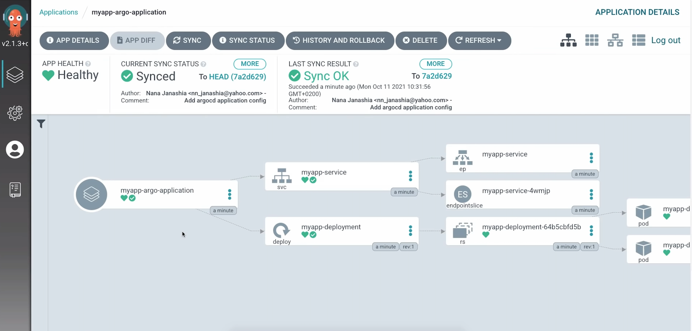

# 🚀 ArgoCD App with Kubernetes GitOps

This project demonstrates how to deploy a simple application to a Kubernetes cluster using **ArgoCD** and **GitOps** principles. It integrates advanced Kubernetes features like Ingress, Autoscaling, and Secrets/ConfigMaps, all managed declaratively via Git.

---

## 🧰 Tech Stack

- 🧠 **GitOps Tool**: [ArgoCD](https://argo-cd.readthedocs.io/en/stable/)
- 📦 **Container Platform**: Kubernetes
- ⚙️ **Manifests Management**: Kustomize
- 🌐 **Exposure**: Ingress Controller (NGINX)
- 📊 **Scalability**: Horizontal Pod Autoscaler (HPA)
- 🔐 **Security**: ConfigMap & Secrets
- 🧪 **Deployment Strategy**: Continuous Delivery with Git sync

---

## 📂 Repository Structure

```

argocd-app/
├── dev/                     # Kubernetes application manifests
│   ├── deployment.yaml
│   ├── service.yaml
│   ├── ingress.yaml
│   ├── hpa.yaml
│   ├── configmap.yaml
│   ├── secret.yaml
│   └── kustomization.yaml
├── argocd/                  # ArgoCD application declaration
│   └── application.yaml
└── README.md

````

---

## ✅ Features Implemented

| Feature                            | Status  |
|------------------------------------|---------|
| ArgoCD integration with K8s        | ✅ Done |
| Ingress (NGINX) for external access| ✅ Done |
| Horizontal Pod Autoscaling (HPA)   | ✅ Done |
| ConfigMap & Secret management      | ✅ Done |
| GitOps workflow with Kustomize     | ✅ Done |
| ArgoCD UI access with port-forward | ✅ Done |

---

## 🧪 Getting Started

### 🔧 Prerequisites

- A running Kubernetes cluster (e.g. Minikube, KinD)
- `kubectl` and optionally `argocd` CLI
- ArgoCD installed on your cluster

### 📥 Install ArgoCD

```bash
# Create the ArgoCD namespace
kubectl create namespace argocd

# Install ArgoCD components
kubectl apply -n argocd -f https://raw.githubusercontent.com/argoproj/argo-cd/stable/manifests/install.yaml
````

### 🌐 Access ArgoCD UI

```bash
# Forward ArgoCD API to localhost:8080
kubectl port-forward svc/argocd-server 8080:443 -n argocd
```

Navigate to: [https://localhost:8080](https://localhost:8080)

### 🔑 Login Credentials

```bash
# Retrieve initial admin password
kubectl -n argocd get secret argocd-initial-admin-secret \
  -o jsonpath="{.data.password}" | base64 --decode && echo
```

> ⚠️ You can (and should) change this password after first login.

---

## 🔁 How It Works

1. You push changes to this GitHub repo.
2. ArgoCD automatically syncs the changes to your Kubernetes cluster.
3. Changes like Ingress rules, autoscaling, or environment configs are applied without manual `kubectl`.

---

## 📸 Screenshots



---

## 📦 Docker Image Used

* 🐳 [Docker Hub Image](https://hub.docker.com/repository/docker/nanajanashia/argocd-app)

---

## 🔗 Useful Links

| Resource          | Link                                                                                                    |
| ----------------- | ------------------------------------------------------------------------------------------------------- |
| Install ArgoCD    | [ArgoCD Installation Docs](https://argo-cd.readthedocs.io/en/stable/getting_started/#1-install-argo-cd) |
| Login with CLI    | [Login Docs](https://argo-cd.readthedocs.io/en/stable/getting_started/#4-login-using-the-cli)           |
| Declarative Setup | [Declarative Config Guide](https://argo-cd.readthedocs.io/en/stable/operator-manual/declarative-setup/) |

---

## 🛠️ Next Features To Implement

* 🔐 RBAC configuration per namespace
* 📊 Prometheus + Grafana integration
* 🚀 Canary / Blue-Green Deployments
* 🔁 Application Rollback support
* 🔒 Network Policies for pod communication
* ⚙️ CI/CD with GitHub Actions (build + auto-sync)

---

## 🤝 Contributing

Contributions and ideas are welcome! Feel free to open issues or submit PRs.

---

## 📄 License

This project is open-source and available under the [MIT License](LICENSE).
